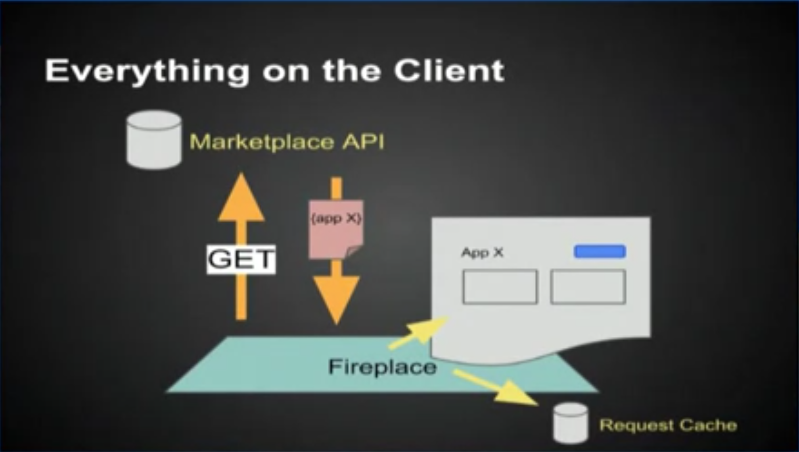
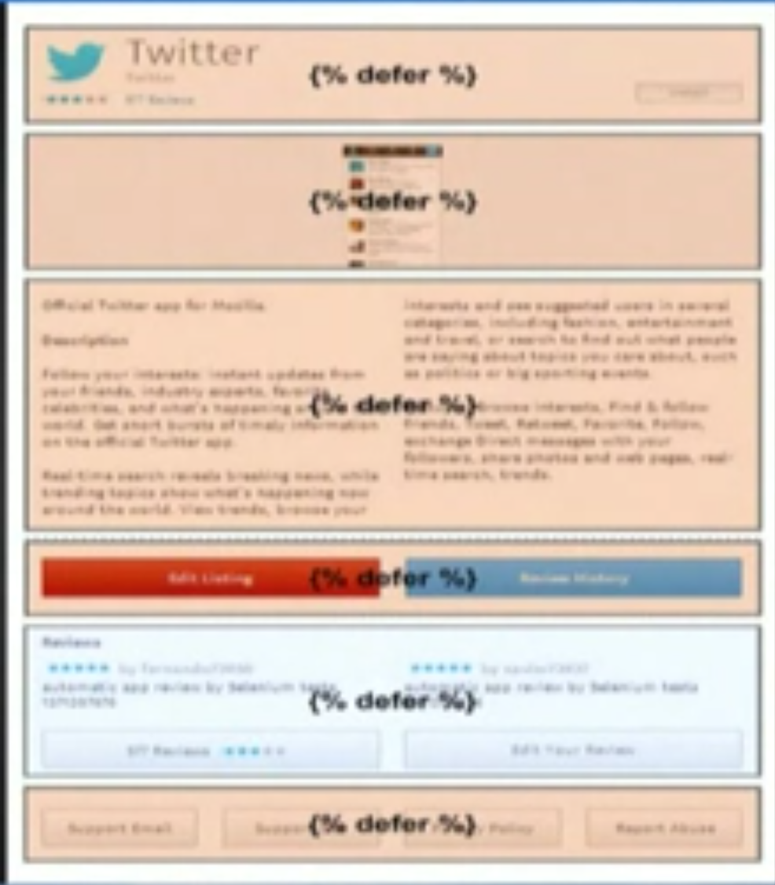

.. _framework:

Marketplace Framework
=====================

This section describes on a high-level the framework that we use when
developing our frontend projects. Let's call it the Marketplace Framework. The
Marketplace Framework is an in-house MVC framework comprised of
`AMD modules <https://github.com/amdjs/amdjs-api/blob/master/AMD.md>`_ and
`Nunjucks templates <https://http://mozilla.github.io/nunjucks/>`_
that allows us build to performant single-page apps. We'll go over in-depth
what the Marketplace Framework looks like.

If you are curious why we have our own framework, and not use something like
Backbone or Angular? Simply put for Backbone, it had a lot stuff we didn't need
like syncing and data manipulation as the main Marketplace is largely
read-only, and it didn't suit our needs. Angular was tempting, but we wanted
the flexibility to render templates server-side, and the l10n support wasn't
quite there.

If you want a quick run-down, you can watch a 20-minute video of the "masta"
of the framework, Matt Basta,
`talking about the framework and the decisions behind it
<https://air.mozilla.org/building-the-firefox-marketplace/>`_. We highly
recommend watching it.

Goals of the Marketplace Framework
~~~~~~~~~~~~~~~~~~~~~~~~~~~~~~~~~~

Performance (and perceived performance) on low-end devices is the headlining
goal:

* Have everything client-side (even the templates) for less requests
* Use RESTful APIs for everything for asynchronous and deferred loading
* Always show something (throbbers) to the user while data is being fetched
* Cache as much as possible
* Modular components and reusable code
* Pave the way for the Marketplace to become a
  `packaged app <https://developer.mozilla.org/Marketplace/Options/Packaged_apps>`_.

Everything Client-Side
~~~~~~~~~~~~~~~~~~~~~~

Here is a simple diagram of the client-side Marketplace (codename Fireplace).
It's pretty straightforward description of a single-page app:



* Data is requested from the API
* The client receives the data
* The client renders the page with the data
* The client stores the data in its request cache (key-value store keyed by URL)

When we navigate to another page, we simply have to fetch data from another
endpoint since the page rendering happens client-side. When we navigate to an
already-visited page, the request goes to the cache. Less requests, better
performance.

.. _fetching-restful-apis:

Fetching and Rendering Data from RESTful APIs
~~~~~~~~~~~~~~~~~~~~~~~~~~~~~~~~~~~~~~~~~~~~~

While an asynchronous request to an API endpoint is being made, we generally
want to show something to the user in the process, like a spinner. And when
the data comes in, we want to replace that *placeholder* with rendered
markup. To do so, the Marketplace Frontend implements in the page rendering
engine something called a *defer block*, which is used from the templates. Here
is a visual representation using for example an
`Marketplace app detail page <https://marketplace.firefox.com/app/twitter>`_:



From the templates, it might look like::

    
      <h1 class="app-name">{{ this.name }}</h1>
    
      <p>Loading app data...</p>
      <div class="spinner"></div>
    

Each defer block is a request to an API endpoint. In the defer block
*signature*, you pass in a URL. In the defer block body, you add the templating
markup you want displayed once the data comes in. In the *placeholder block*,
you add templating markup you want displayed while the data is loading. The
defer block is one of the magical facilities that the Marketplace Framework
provides.

Caching
~~~~~~~

Caching makes the Marketplace fast. When data is cached, the client doesn't
have to wait for API responses and can render data almost immediately. On top
of caching data in memory, we also persistently cache the data in LocalStorage
so it stays in effect on subsequent visits. We have two forms of caching:

* request caching
* model caching

Request Caching
_______________

Remember the defer blocks above? Under the hood, it caches data from its API
endpoint. It does this by invoking our requests module, *request-caches*
all GET requests by default into memory, which will later be pesistently cached
in LocalStorage. An entry in the request cache is keyed by the API endpoint
URL which points to the value of the response. For example::

    {
        'https://marketplace.firefox.com/api/v2/app/twitter': {
            'author': 'Twitter',
            'name': 'Twitter',
            ...
        }
    }

Model Caching
_____________

Model caching is a more granular form of caching. It is useful when we request
a list of data, and each entry in that list represents an object. For instance,
an app listing endpoint returns a list of apps. Model caching allows us to
extract from the list and store each object in the cache individually such that
we can access that specific object individually.

The defer block handles this as well, though we need to pass in some parameters
to its signature. For instance::

    {% defer (url='https://marketplace.firefox.com/api/v2/feed/collection/list-of-apps',
              as='app', key='slug')
      ...
    

This requests an endpoint that returns a list of apps. We tell the defer block
to *model-cache* these *as* an *app* and *key* them in the cache by their slug
field. Whereas request caching invokes our requests module, model caching
invokes our models module (although the models module will call our requests
module if the model cache hasn't been primed). The model cache might look like::

    {
        'apps': {
            'facebook': {
                'author': 'Facebook',
                'name': 'Facebook',
            },
            'twitter': {
                'author': 'Twitter',
                'name': 'Twitter',
                ...
            }
        }
    }


Modular Components and Reusable Code
~~~~~~~~~~~~~~~~~~~~~~~~~~~~~~~~~~~~

The Marketplace Framework is split into many different repositories, all hosted
on an appropriate package manager (NPM or Bower). These components are
reusable, as in any projects can consume them. And they are modular, such that
they can be updated one piece at a time, and projects and pull in those
updates.

With stuff separately hosted in NPM and Bower, when a component is updated and
a frontend project wishes to pull in the updates, all that needs to be done is
to bump the version number in the `package.json` or `bower.json`.

For example, we have a component, `Marketplace Core Modules
<https://github.com/mozilla/marketplace-core-modules>`_.  Whenever a project
wishes to update these modules, they push an update to the repository and tag a
version. Then other projects are able to enjoy the benefits of the updated
modules by bumping their ```bower.json``` to the updated tag.

If you want a complete listing of all the modules and components, head to
the `index page of this documentation <https://http://marketplace-frontend.readthedocs.org/en/latest/index.html>`_.
